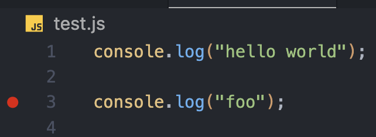

PNPM Vscode Debugger Bug

# Steps to reproduce:

1. Setup breakpoints in the `test.js` file.



2. Open the JavaScript Debug Terminal via the command palette:

MacOSX

```
Cmd + Shift + P
```

Linux/Windows

```
Ctrl + Shift + P
```

3. Run with `pnpm node test.js`

# Expected behavior:

The debugger should stop at the breakpoints set in `test.js`.

# Actual behavior:

The debugger does not stop at the breakpoints. Instead, it runs the script without pausing.

# Fix:

Comment out the `nodeOptions` line in `pnpm-workspace.yaml`:

```yaml
# nodeOptions: "--experimental-vm-modules"
```

Re-run the script with `pnpm node test.js` and the debugger will stop at the breakpoints as expected.
